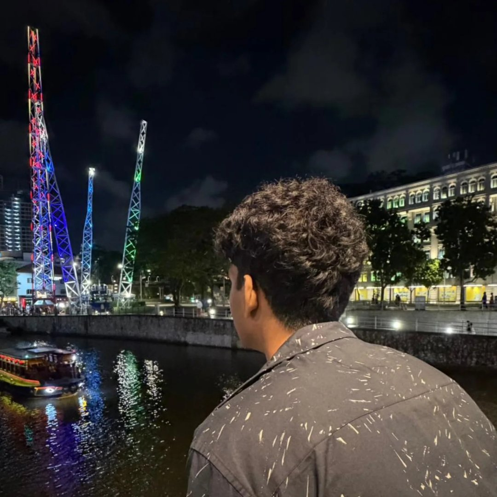

  
  

    <h1 class="title">Hi I'm J!</h1>
    

  <a href="https://github.com/TheInvadr" target="_blank" rel="noopener" style="display:inline-flex;align-items:center;gap:0.5rem;text-decoration:none;color:var(--color-accent-2);">
    <svg stroke="currentColor" fill="currentColor" stroke-width="0" viewBox="0 0 24 24" aria-hidden="true" style="width:20px;height:20px;opacity:0.9;" xmlns="http://www.w3.org/2000/svg"><path fill-rule="evenodd" clip-rule="evenodd" d="M12.026 2c-5.509 0-9.974 4.465-9.974 9.974 0 4.406 2.857 8.145 6.821 9.465.499.09.679-.217.679-.481 0-.237-.008-.865-.011-1.696-2.775.602-3.361-1.338-3.361-1.338-.452-1.152-1.107-1.459-1.107-1.459-.905-.619.069-.605.069-.605 1.002.07 1.527 1.028 1.527 1.028.89 1.524 2.336 1.084 2.902.829.091-.645.351-1.085.635-1.334-2.214-.251-4.542-1.107-4.542-4.93 0-1.087.389-1.979 1.024-2.675-.101-.253-.446-1.268.099-2.64 0 0 .837-.269 2.742 1.021a9.582 9.582 0 0 1 2.496-.336 9.554 9.554 0 0 1 2.496.336c1.906-1.291 2.742-1.021 2.742-1.021.545 1.372.203 2.387.099 2.64.64.696 1.024 1.587 1.024 2.675 0 3.833-2.33 4.675-4.552 4.922.355.308.675.916.675 1.846 0 1.334-.012 2.41-.012 2.737 0 .267.178.577.687.479C19.146 20.115 22 16.379 22 11.974 22 6.465 17.535 2 12.026 2z"></path></svg>
    GitHub
  </a>
  <a href="mailto:jrosseruk@gmail.com" style="display:inline-flex;align-items:center;gap:0.5rem;text-decoration:none;color:var(--color-accent-2);">
    <svg xmlns="http://www.w3.org/2000/svg" width="16" height="16" fill="currentColor" class="bi bi-envelope" viewBox="0 0 16 16" style="width:20px;height:20px;opacity:0.9;"> <path d="M0 4a2 2 0 0 1 2-2h12a2 2 0 0 1 2 2v8a2 2 0 0 1-2 2H2a2 2 0 0 1-2-2zm2-1a1 1 0 0 0-1 1v.217l7 4.2 7-4.2V4a1 1 0 0 0-1-1zm13 2.383-4.708 2.825L15 11.105zm-.034 6.876-5.64-3.471L8 9.583l-1.326-.795-5.64 3.47A1 1 0 0 0 2 13h12a1 1 0 0 0 .966-.741M1 11.105l4.708-2.897L1 5.383z" stroke="currentColor" stroke-width="0.5"/></svg>
  Email
  </a>
    

  

<!-- I'm a 2nd year **DPhil student in Machine Learning at the University of Oxford**, supervised by Jakob Foerster and focusing on AI Security, Safety, and Interpretability. I'm best known for my **NeurIPS 2025 Spotlight paper AgentBreeder**, which explores evolutionary automated red team and blue team scaffold generation.

I'm currently working on **[Infusion](https://arxiv.org/abs/2602.09987)** - a framework for shaping model behavior by editing training data via influence functions. I'm participating in **Neel Nanda's MATS 10.0 Exploration Phase** and recently served as a **Teaching Assistant for ARENA 7.0** (Mechanistic Interpretability week).

Previously, I was a **Research Scientist Intern at Spotify** and worked with **UK AISI on agentic scaffolds for Inspect** as part of their Bounty Programme. I was also the founding Research Scientist at Convergence (acquired by Salesforce for est. $200M), contributing to Proxy, a state-of-the-art multimodal web agent with 100k+ users.

I'm a member of LISA (London Initiative for Safe AI) and enjoy playing trumpet in a funk band, running bouldering socials, and helping new climbers get certified.

P.S. There are some easter eggs on this website - find one and drop the emoji in your email subject line! -->
I'm a 17 year old who's interested in computer science, math and video games.